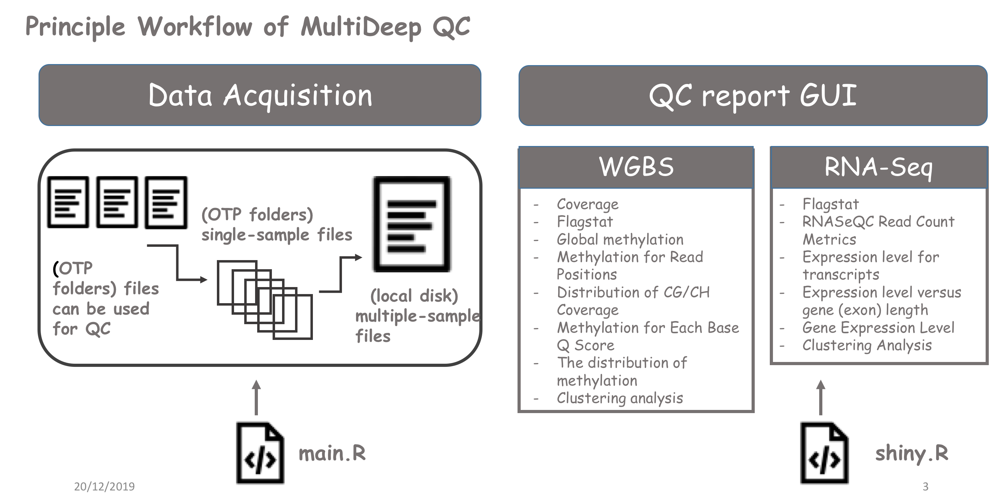
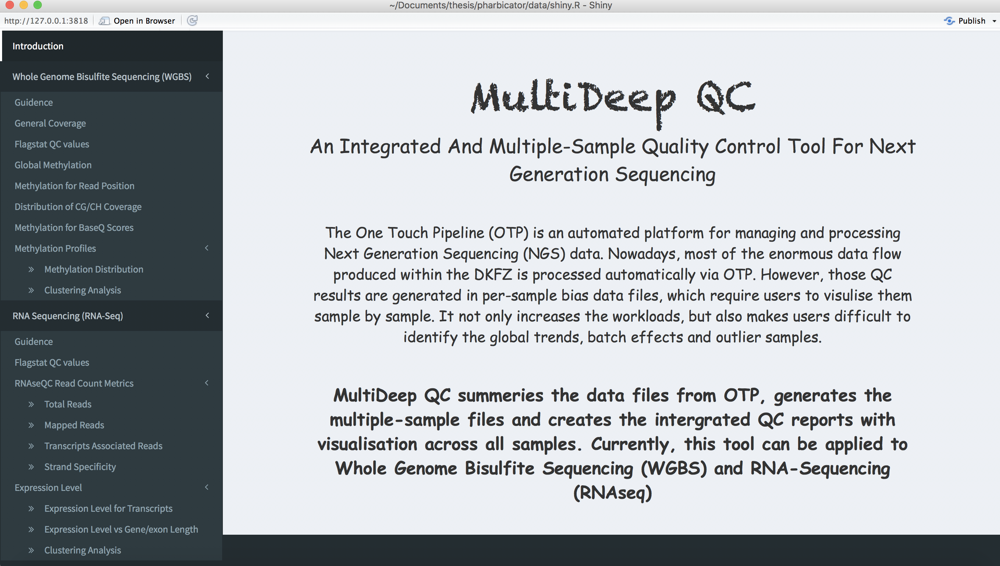

# MultideepQC

The tool is used to process the files produced by the One Touch Pipline (OTP), a platform for Next Generation Sequence data organision and analysis. 

## The tool contains two parts: 

1. **Data Acquisition** :
summarise multiple samples in one table 

2. **Qualtity Control visualtion** :
visualise the result across multiple samples 

## Principle Workflow

### Data Acquisition
1. Run the script [main.R](https://github.com/leungman426/MultideepQC/tree/master/main.R) in the command line: 

`Rscript main.R --WGBS hipo_016 --RNASeq hipo_043 /home/document` */home/document is where you store the newly created /data folder*
  
     
2. Inside the /data, you can find out the script [shiny.R](https://github.com/leungman426/MultideepQC/tree/master/shinyprocess/shiny.R) and run it

### Qualtity Control visualtion

