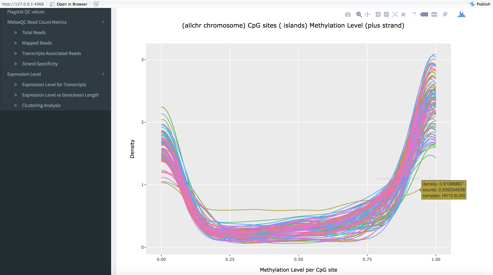

# MultideepQC

The tool is used to summerise and visualise the files generated by the One Touch Pipline (OTP), a platform for Next Generation Sequence data organision and analysis. 

## Features 

**Multiple-sample QC in addition to the single-sample QC**  
- visualisation and data table across samples
- identify global trend, batch effects and outlier samples
- Integrate many interesting QC values

**QC reports in a Graphic User Interface(GUI)**
- *no programming skills required*
- detailed guidance
- easily distributed among the researchers

**Generates multiple-sample data files**
- users can use them for other analyses and visualisations 

**Modularisation**
- robust and can easily integrate more functions 

## The tool contains two parts: 

1. **Data Acquisition** :
summarise multiple samples in one table 

2. **Data summarisation and visualisation** :
visualise the result across multiple samples 

## Principle Workflow

## Usage

### Data Acquisition
 Run the script [main.R](https://github.com/leungman426/MultideepQC/tree/master/main.R) in the command line and it creates a folder called 'data' containing multiple-sample files and R scripts: 

`Rscript main.R --WGBS hipo_XXX --RNASeq hipo_XXX /home/document` *(hipo_XXX is hipo porject name e.g. hipo_016; /home/document is where you store the newly created /data folder)*
  
### Data summerisation and visualisation   
 Open the /data, you can find out the script [shiny.R](https://github.com/leungman426/MultideepQC/tree/master/shinyprocess/shiny.R) and run it

#### RNAseq
- Flagstat
- RNASeQC Read Count Metrics
- Expression level for transcripts
- Expression level versus gene (exon) length
- Gene Expression Level
- Clustering Analysis

#### WGBS
- Coverage 
- Flagstat
- Global methylation 
- Methylation for Read Positions
- Distribution of CG/CH Coverage
- Methylation for Each Base Q Score
- The distribution of methylation
- Clustering analysis 

